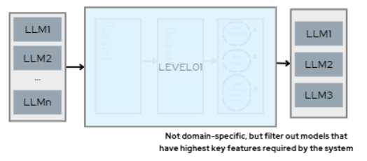
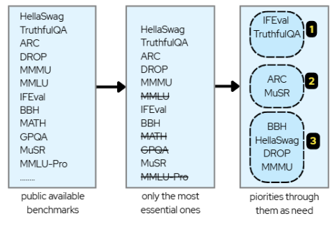
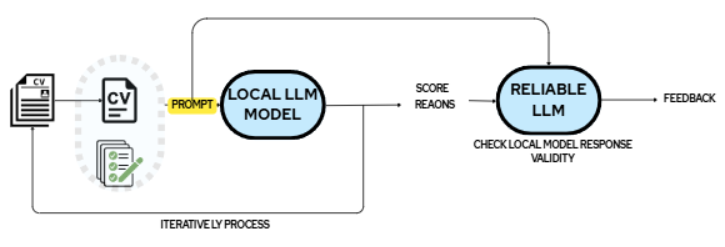
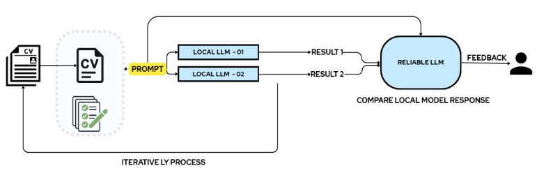

## IN PROGRESS......
# How to Choose the Best LLM for Your Work

Not all LLMs are the same. Each provider uses different techniques, meaning some models excel at certain tasks but may fall short on others. To get the best results, you need to identify which LLM is best suited for your specific application.

This guide focuses on evaluating LLMs themselves—not the entire application. While there are many ways to make a full system reliable (discussed in a later section), here we concentrate on **choosing the LLM that fits your needs**, essentially the brain of your system.

## Level 1 - Open Benchmark Usage

- Use public benchmarks selectively, prioritizing those that match your needs.  
- Keep in mind: models are often exposed to these benchmarks during training, so performance may not reflect true generalization. Still, they are useful for **initial filtering**.

Models on public leaderboards, like Hugging Face, can be compared directly by adjusting evaluation settings. For quantized versions, test results may be available in associated repositories or result tables.  
If high-priority benchmark results are unavailable or unreliable, or if further adjustments are needed for your use case, **local evaluations** can be performed using available test data and methods.  

> **Example:**  
> Instruction-following is important for your use case. Using benchmarks focused on this can help ensure the model meets your performance expectations.  

**Benchmark Example:**  
- **IFEval Benchmark (Instruction-Following Evaluation)**  
- Evaluates the LLM’s ability to follow natural language instructions.  
- Includes 25 instruction types with ~500 prompts, such as:  
  - Write more than 400 words  
  - Output entirely in JSON format  
  - List the top 10 facts about the UK without using commas  

A robust verification approach should account for common variations in responses.

**Evaluation Methods:**  
- `is_followed(resp, inst);` → Programmatic, rule-based logic  
- `is_followedloose(resp, inst) = Any is_followed(transform(resp), inst)` → Programmatic with response transformation to avoid false negatives  

**Results:**  
Based on the benchmark, you can further improve evaluation by developing a **custom test set** tailored to your specific LLM and system requirements.

## Level 2 - Internal Tests

- Perform domain-specific tests on selected models to verify claimed capabilities.  
- Benchmark results alone may not be sufficient; manual validation can be crucial.  
- Focus on a **small but impactful set of tests**, covering frequent question types relevant to your use case.  
- Test cases can be created by humans or another reliable LLM, acting as a baseline QA for any model.  
- Evaluations can be done via an LLM or compared against a predefined set of answers.  

**Example Tests:**  

| Test | Evaluation Method |
|------|-----------------|
| Generate C++ code for a given task | Reliable LLM / programmatic / human |
| Extract hidden ideas within a functional context window | Programmatic / human |

**Additional Guidelines:**  
- Incrementally increase task difficulty to test model robustness.  
- Assign computationally intensive tasks to assess performance under load  
  - **Example:** Text-to-SQL conversion  
- Measure **instruction-following and understandability**.  
- Evaluate performance based on the quality and correctness of generated results.

## Level 3 - Application-Specified

Consider an application such as scoring CVs for a job opening.

### Level 3.1 - Tests Through a Reliable LLM

- Identify scenarios that significantly affect model behavior.  
- Models should **not hallucinate** when given correct prompts.  
- Including information from the model's own memory in context can negatively impact scoring and should be avoided.

**Test Cases and Methods:**  

**Method 1:**  
- Use a set of 10 CVs for evaluation based on the job description (JD).  
- Submit the evaluation results and prompts to a **reliable LLM** with predefined guidelines to identify issues like hallucinations.  

**Method 2:**  
- Compare reasoning from multiple LLMs for the same scenario.  
- Evaluate missed and gained points in scoring.  
- Include human review for better accuracy.  

**Method 3:**  
- Prepare typical interview questions to “interview” LLMs.  
- Evaluate requirement fulfillment, necessary candidate information, and detect biases.  
- Submit generated responses and queries to a reliable LLM for performance feedback.

---

### Level 3.2 - Arena Mode Evaluations

- Use **human-in-the-loop** evaluations to identify the most reliable model.  
- Two unknown models generate outputs for the same CV set.  
- Domain-specific human evaluators review outputs and select those best aligned with requirements.  
- Evaluators’ judgments are assumed to reflect true output quality.  

**Application:**  
- Open-source systems can let users rate outputs (thumbs up/down).  
- Ratings compute Elo scores to determine model performance over time.  
- Useful during early implementation to identify the most suitable model based on actual feedback.

---

### Level 3.3 - Utilizing a Predefined Dataset

- Use real-world application data and results:  
  - Submit a collection of CVs for a job opening.  
  - The hiring process produces a shortlist (ground truth).  
  - The model generates its own shortlist.  

- Compare model-generated shortlist with the actual one.  
- If the model correctly identifies at least **x%** of shortlisted candidates, it is considered highly reliable.  
- Analyze mismatches to determine whether the model failed or potentially outperformed humans in candidate selection.

## Benchmarks References

- **HellaSwag – Evaluate common sense**  
  Focus: Common sense reasoning  
  Tests: Sentence completion requiring real-world knowledge and plausibility judgment  
  [PDF](https://arxiv.org/pdf/1905.07830)  

- **TruthfulQA – Evaluate truthfulness**  
  Focus: Factual correctness  
  Tests: Whether the model gives factually accurate and honest answers  
  [PDF](https://arxiv.org/pdf/2109.07958)  

- **ARC (AI2 Reasoning Challenge) – Evaluate reasoning skills**  
  Focus: Logical and scientific reasoning  
  Tests: Grade-school level science multiple-choice questions  
  [PDF](https://arxiv.org/pdf/1803.05457)  

- **DROP (Discrete Reading Comprehension) – English reading comprehension**  
  Focus: Understanding and reasoning over paragraphs  
  Tests: Extractive QA requiring logical inferences from text  
  [PDF](https://arxiv.org/pdf/1903.00161)  

- **MMMU (Massive MultiModal Understanding) – Multimodal capabilities**  
  Focus: Vision and language integration  
  Tests: Multimodal reasoning across scientific and real-world topics  
  [PDF](https://arxiv.org/pdf/2311.16502)  

- **MMLU (Massive Multitask Language Understanding) – Evaluate multitask performance**  
  Focus: General academic and professional knowledge  
  Tests: 57+ subjects including STEM, law, medicine, humanities  
  [PDF](https://arxiv.org/pdf/2009.03300)  

- **IFEval (Instruction Following Evaluation) – Format alignment**  
  Focus: Instruction-following accuracy  
  Tests: Model's ability to follow explicit formatting or layout instructions  
  [PDF](https://arxiv.org/pdf/2311.07911)  

- **Big Bench Hard (BBH) – Evaluate reasoning and world knowledge**  
  Focus: Language understanding, mathematical reasoning, and common sense  
  Tests: Diverse set of challenging tasks for LLMs across domains  

- **MATH (Mathematics Aptitude Test of Heuristics) – Mathematical reasoning**  
  Focus: High school level competition problems  
  Tests: Complex algebra, geometry, advanced calculus, and proofs  

- **GPQA (Graduate-Level Google-Proof Q&A) – Expert-level science**  
  Focus: PhD-level scientific knowledge  
  Tests: Multiple-choice questions in chemistry, biology, and physics  

- **MuSR (Multistep Soft Reasoning) – Long-context reasoning**  
  Focus: Reasoning and understanding over extended texts  
  Tests: Language understanding, multi-step reasoning, and long-context analysis  

- **MMLU-Pro (Professional Massive Multitask Language Understanding) – Professional-level multitasking**  
  Focus: Domain-specific expertise  
  Tests: Expert-reviewed multiple-choice questions in fields like: Medicine and healthcare, Law and ethics, Engineering, Mathematics  
  [PDF](https://www.researchgate.net/publication/381152925_MMLU-Pro_A_More_Robust_and_Challenging_Multi-Task_Language_Understanding_Benchmark)  

